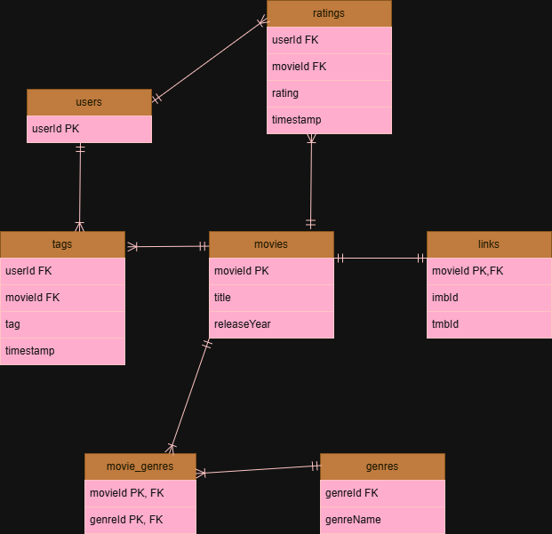

# DS-4320-Project1

# DS 4320 Project 1: Building a Relational Movie Recommendation Dataset from MovieLens

## Executive Summary
This project builds a relational secondary dataset from the MovieLens “latest small” dataset to support personalized movie recommendations. The raw data is transformed into a normalized relational structure with linked tables for users, movies, ratings, tags, links, genres, and movie_genres. Using Python, SQL, DuckDB, and collaborative filtering, the project demonstrates how relational data design and machine learning can be used together to recommend movies a user is likely to enjoy.

## Name
Eden Mulugeta

## NetID
unb6ny

## DOI
[Insert Zenodo DOI here]

## Press Release
[View Press Release](press_release/press_release.md)

## Data
[View UVA OneDrive Folder](https://myuva-my.sharepoint.com/:f:/g/personal/unb6ny_virginia_edu/IgBo51GznZw8TL-g7bBbxysOAZg3nQkwR7IbgV9glyXy-t8?e=zxWWiI)

## Pipeline
[View Jupyter Notebook](pipeline/project1_pipeline.ipynb)  
[View Markdown Export](pipeline/project1_pipeline.md)

## License
MIT License  
[View License](LICENSE)

---

## Problem Definition

### Initial General Problem
Recommending content (e.g., Netflix)

### Refined Specific Problem
How can we use user ratings and interactions to generate personalized movie recommendations that better match individual preferences? 

This project focuses on building a relational movie recommendation dataset that supports personalized movie suggestions using user ratings, tags, and movie metadata from the MovieLens dataset. The goal is to identify movies that a user has not yet seen but is likely to enjoy based on patterns in their past interactions.

### Refinement Rationale
The general problem of recommending content is very broad because it could include movies, music, books, social media posts, or advertisements. To make the project more focused and manageable, I narrowed the topic to movie recommendations. This refinement makes sense because the MovieLens dataset provides a clear relational structure with separate tables for movies, ratings, tags, and links, which fits the project requirement of creating a secondary dataset using the relational model. Focusing on movies also makes the problem realistic and easy to explain, since recommendation systems are widely used on streaming platforms like Netflix.

### Motivation
This project is important because recommendation systems help users find content more efficiently in large digital platforms. Personalized recommendations improve user experience by reducing the time spent searching and increasing the chance that users will find something they actually enjoy. This project also shows how real-world user behavior data can be organized into a relational dataset and used with SQL, Python, and machine learning to solve a practical problem.

### Press Release Headline
How Personalized Movie Recommendations Can Improve What You Watch

[View Press Release](press_release/press_release.md)

---

## Domain Exposition
This project is in the domain of recommender systems, which are used by platforms like Netflix and Spotify to suggest content to users. These systems analyze user behavior, such as ratings or viewing history, to predict what users might like.

### Terminology

| Term | Definition |
|------|------------|
| User | A person who interacts with the platform and provides ratings or tags for movies. |
| Movie (Item) | A piece of content that can be recommended to users. |
| Rating | A numerical score from 0.5 to 5.0 given by a user to show how much they liked a movie. |
| Tag | A user-generated label or keyword describing a movie. |
| Genre | A category describing the type of movie, such as Comedy or Drama. |
| Recommendation System | A system that suggests items to users based on behavior or preferences. |
| Collaborative Filtering | A method that recommends items based on patterns from similar users. |
| Content-Based Filtering | A method that recommends items similar to those a user liked before. |
| User Preference | Patterns in a user’s ratings or behavior that show what they tend to like. |
| Metric | A value used to measure performance, such as average rating or number of ratings. |
| User-Movie Matrix | A table that shows users as rows, movies as columns, and ratings as values. |
| Cosine Similarity | A measure used to calculate how similar two users are based on their ratings. |
| Recommendation Score | A value that shows how strongly a movie is recommended to a user. |

### Domain Description
This project belongs to the domain of recommender systems, which are widely used by platforms such as Netflix, Spotify, and Amazon to personalize user experiences. These systems analyze user behavior, such as ratings, interactions, and preferences, to suggest content a user is likely to enjoy. In this project, the focus is on movie recommendation using the MovieLens dataset, where ratings and tags help reveal patterns in user preferences. This makes the domain practical, relevant, and well suited for showing how relational data and machine learning can work together in a real-world application.

### Background Reading
The background readings are stored in the `background_readings/` folder and provide context about recommendation systems, collaborative filtering, and the MovieLens dataset.

| Title | Type | Description | File | Source |
|------|------|------------|------|--------|
| MovieLens Dataset (GroupLens) | Dataset Documentation | Official dataset description and source information for MovieLens. | [PDF](background_readings/MovieLens.pdf) | [Link](https://grouplens.org/datasets/movielens/) |
| Movie Recommender Systems: Concepts, Methods, Challenges | Research Paper | Overview of major recommender system methods and challenges. | [PDF](background_readings/Movie%20Recommender%20Systems.pdf) | [Link](https://pmc.ncbi.nlm.nih.gov/articles/PMC9269752/) |
| Movie Recommendation with Machine Learning | Article | Explains how movie recommendation systems can be built with machine learning. | [PDF](background_readings/What%20Is%20a%20Movie%20Recommendation%20System%20in%20ML.pdf) | [Link](https://labelyourdata.com/articles/movie-recommendation-with-machine-learning) |
| Collaborative Filtering: A Simple Introduction | Article | Beginner-friendly explanation of collaborative filtering. | [PDF](background_readings/Collaborative%20Filtering_A%20Simple%20Introduction.pdf) | [Link](https://builtin.com/data-science/collaborative-filtering-recommender-system) |
| Collaborative Filtering: How to Build a Recommender System | Tutorial | Practical guide to implementing collaborative filtering. | [PDF](background_readings/Collaborative%20filtering_How%20to%20build%20a%20recommender%20system.pdf) | [Link](https://redis.io/blog/collaborative-filtering-how-to-build-a-recommender-system/) |
---

## Data Creation

### Data Provenance
The raw data for this project comes from the MovieLens “latest small” dataset. It contains user-generated movie ratings, tags, and movie metadata. The dataset includes over 100,000 ratings and over 3,000 tag applications across thousands of movies and hundreds of users. The raw data was obtained from GroupLens and downloaded as CSV files: `movies.csv`, `ratings.csv`, `tags.csv`, and `links.csv`.

This raw data was used as the foundation for constructing a secondary relational dataset, D1, for this project. The source files are stored in the `data/raw/` folder, and the transformed output files are stored in the `data/processed/` folder.

### Data Construction Process
To construct the dataset, the raw MovieLens data was cleaned and transformed into a normalized relational structure. A `users` table was created by extracting the unique user IDs from the ratings and tags tables. The `movies` table was enhanced by extracting release year from the movie title field.

The original `genres` field in `movies.csv` contained multiple values in one column separated by `|`, which is not ideal in a relational design. To normalize this field, I created a separate `genres` table containing unique genre values and a `movie_genres` table to represent the many-to-many relationship between movies and genres.

The final processed dataset contains seven tables: `users`, `movies`, `ratings`, `tags`, `links`, `genres`, and `movie_genres`. This structure supports efficient SQL querying and recommendation analysis.

### Code Table

| File Name | Type | Description | Link |
|-----------|------|------------|------|
| project1_pipeline.ipynb | Notebook | Main pipeline notebook for loading raw data, cleaning it, building the relational dataset, querying with DuckDB, and implementing recommendation models. | [File](pipeline/project1_pipeline.ipynb) |
| project1_pipeline.md | Markdown | Markdown export of the notebook required for submission and easier repo viewing. | [File](pipeline/project1_pipeline.md) |

### Bias Identification
Bias in this dataset may come from how the original MovieLens data was collected. Users were only included if they had rated at least 20 movies, which creates bias toward more active users. This means the data may not represent casual users who rate very little or interact less often.

There is also subjectivity bias in ratings because different users interpret the rating scale differently. Some users may rate generously while others rate more strictly. In addition, users are more likely to rate movies they feel strongly about, which may overrepresent extreme opinions.

### Bias Mitigation
To reduce the impact of these biases, the analysis uses patterns across many users instead of relying too heavily on any one individual. Aggregated measures such as average ratings and minimum rating-count thresholds help reduce the effect of unusual values. The project also acknowledges that findings are limited to the type of users represented in the dataset, especially active raters. Using both ratings and tags provides more context than relying on a single signal alone.

### Rationale for Decisions
The MovieLens “latest small” dataset was chosen because it is large enough to support meaningful analysis while still being manageable for a class project. It also provides multiple connected tables, which makes it a strong fit for a relational modeling assignment.

Several judgment calls were made during construction. The genres column was normalized into separate `genres` and `movie_genres` tables to remove a multi-valued field and improve relational quality. Ratings were used as the primary preference signal because they give a direct measure of user opinion, but they are subjective and therefore introduce uncertainty. Tags were kept as an additional source of user input because they help provide more descriptive context, even though tag meanings may vary between users.

---

## Metadata

### Schema (ER Diagram)
The dataset follows a relational model with seven tables: `users`, `movies`, `ratings`, `tags`, `links`, `genres`, and `movie_genres`. The ER diagram below shows the logical structure of the dataset.

### Data Tables

| Table Name | Description | Link |
|-----------|------------|------|
| users | Contains unique user identifiers extracted from ratings and tags. | [users.csv](data/processed/users.csv) |
| movies | Contains movie metadata including title and release year. | [movies.csv](data/processed/movies.csv) |
| ratings | Contains user ratings for movies. | [ratings.csv](data/processed/ratings.csv) |
| tags | Contains user-generated tags describing movies. | [tags.csv](data/processed/tags.csv) |
| links | Contains external identifiers linking movies to IMDb and TMDb. | [links.csv](data/processed/links.csv) |
| genres | Contains unique genre categories. | [genres.csv](data/processed/genres.csv) |
| movie_genres | Bridge table linking movies to genres (many-to-many relationship). | [movie_genres.csv](data/processed/movie_genres.csv) |

### Data Dictionary

| Table | Column Name | Data Type | Description | Example |
|------|------------|----------|------------|---------|
| users | userId | integer | Unique identifier for a user | 1 |
| movies | movieId | integer | Unique identifier for a movie | 1 |
| movies | title | string | Movie title including the release year in parentheses | Toy Story (1995) |
| movies | releaseYear | integer | Year the movie was released, extracted from the title | 1995 |
| ratings | userId | integer | User who provided the rating | 1 |
| ratings | movieId | integer | Movie being rated | 1 |
| ratings | rating | float | Rating given by the user on a 0.5 to 5.0 scale | 4.0 |
| ratings | timestamp | integer | Unix timestamp showing when the rating was created | 964982703 |
| tags | userId | integer | User who created the tag | 2 |
| tags | movieId | integer | Movie being tagged | 60756 |
| tags | tag | string | User-generated description of the movie | funny |
| tags | timestamp | integer | Unix timestamp showing when the tag was created | 1445714994 |
| links | movieId | integer | Movie identifier linking to the movies table | 1 |
| links | imdbId | integer | IMDb identifier for the movie | 114709 |
| links | tmdbId | float | TMDb identifier for the movie, which may be missing | 862 |
| genres | genreId | integer | Unique identifier for a genre | 1 |
| genres | genreName | string | Name of the genre | Comedy |
| movie_genres | movieId | integer | Movie identifier | 1 |
| movie_genres | genreId | integer | Genre identifier | 3 |

### Uncertainty Quantification
The main numerical features in this dataset are `userId`, `movieId`, `rating`, `timestamp`, `imdbId`, and `tmdbId`.

- `userId` and `movieId` have very low uncertainty because they are identifiers used to uniquely identify records and link tables.
- `rating` has moderate uncertainty because it is subjective and depends on individual user opinion. Different users may apply the same rating scale differently.
- `timestamp` has low measurement uncertainty because it is system recorded, but it does not capture the context behind the user’s behavior.
- `imdbId` and `tmdbId` have low uncertainty as identifiers, although `tmdbId` may have missing values, which affects completeness.
- Derived measures such as counts and averages may be influenced by uneven user participation, because some users contribute far more ratings than others.

