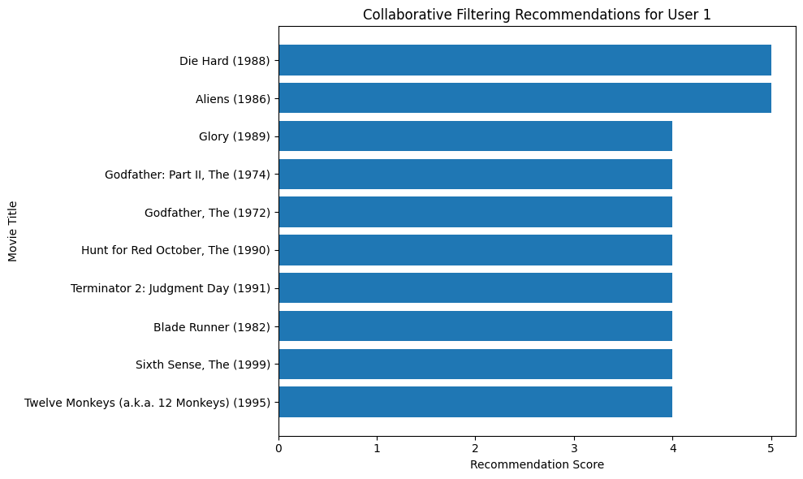

# How Personalized Movie Recommendations Can Improve What You Watch

## Hook
Have you ever spent more time searching for a movie than actually watching one? With so many choices available, it can be hard to decide what to watch, and many people end up picking something randomly or giving up altogether.

## Problem Statement
Streaming platforms provide huge libraries of content, but finding the right movie can still be frustrating. Many users spend too much time browsing or end up choosing movies that do not match their preferences. Although some platforms already use recommendation systems, not all recommendations feel personal or easy to understand. The specific problem in this project is how to use user ratings, tags, and movie information to better identify what a person is likely to enjoy.

## Solution Description
This project builds a movie recommendation system using user ratings and movie metadata from the MovieLens dataset. First, a baseline model recommends movies that are popular and highly rated overall. Then, a collaborative filtering model improves personalization by finding users with similar rating patterns and recommending movies they liked. This creates recommendations that are more tailored to an individual user instead of giving everyone the same list.

## Chart
The chart below shows the top recommended movies for a selected user based on the collaborative filtering model. The recommendation score reflects how often similar users rated these movies highly, which helps identify movies the target user may also enjoy.

